# Workflow-AI: Architecture Documentation

> **Version:** 1.1
> **Date:** 2026-03-23
> **Tech Stack:** .NET 10, Azure Services
> **Pattern:** AI Agent with Human-in-the-Loop (HITL)

---

## Table of Contents

1. [Overview](#1-overview)
2. [Architecture Principles](#2-architecture-principles)
3. [Architecture Style](#3-architecture-style)
4. [System Architecture](#4-system-architecture)
5. [Service Descriptions](#5-service-descriptions)
6. [Communication Patterns](#6-communication-patterns)
7. [Data Architecture](#7-data-architecture)
8. [AI Agent Architecture](#8-ai-agent-architecture)
9. [Human-in-the-Loop Approval Pattern](#9-human-in-the-loop-approval-pattern)
10. [Notification Architecture](#10-notification-architecture)
11. [Connector Management](#11-connector-management)
12. [Logic App Script Generation](#12-logic-app-script-generation)
13. [Security Architecture](#13-security-architecture)
14. [Infrastructure & Deployment](#14-infrastructure--deployment)
15. [Observability](#15-observability)
16. [Cross-Cutting Concerns](#16-cross-cutting-concerns)
17. [Architecture Decision Records (ADRs)](#17-architecture-decision-records-adrs)

---

## 1. Overview

### 1.1 Purpose

Workflow-AI is a platform that enables business users to design, execute, and monitor dynamic workflows powered by AI agents. Each workflow can include AI-generated content/decisions that require human approval before proceeding — implementing the **Human-in-the-Loop (HITL)** pattern.

### 1.2 Key Capabilities

| Capability | Description |
|---|---|
| **Workflow Design** | Visual drag-and-drop workflow builder with reusable templates |
| **AI Agent Execution** | Azure OpenAI-powered steps for content generation, analysis, and decision support |
| **Human Approval** | Multi-channel approval (Web, Email, Slack, Teams) with timeout and escalation |
| **Multi-Channel Notifications** | Dispatch notifications to Slack, Microsoft Teams, and Email |
| **Connector Management** | Create and manage authenticated connectors (OAuth, API Key, MSI) for external services |
| **Logic App Generation** | Auto-generate Azure Logic App ARM/Bicep scripts with API Connections from workflow definitions |
| **Output Delivery** | Email-based delivery of workflow results to stakeholders |

### 1.3 High-Level Flow

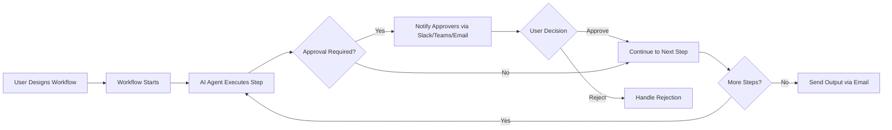
```mermaid
flowchart LR
    A[User Designs Workflow] --> B[Workflow Starts]
    B --> C[AI Agent Executes Step]
    C --> D{Approval Required?}
    D -- Yes --> E[Notify Approvers via Slack/Teams/Email]
    E --> F{User Decision}
    F -- Approve --> G[Continue to Next Step]
    F -- Reject --> H[Handle Rejection]
    D -- No --> G
    G --> I{More Steps?}
    I -- Yes --> C
    I -- No --> J[Send Output via Email]
```

---

## 2. Architecture Principles

| # | Principle | Rationale |
|---|---|---|
| 1 | **Event-Driven** | Decouple services via Azure Service Bus; each service reacts to domain events |
| 2 | **API-First** | All capabilities exposed via RESTful APIs; frontend and integrations consume the same contracts |
| 3 | **Cloud-Native** | Built for Azure; leverage managed services (Cosmos DB, Service Bus, AKS) to minimize ops overhead |
| 4 | **Separation of Concerns** | Each service owns a single domain (workflow, approval, notification, AI) |
| 5 | **Security by Default** | Entra ID authentication, Key Vault for secrets, signed approval tokens, webhook verification |
| 6 | **Observability** | Distributed tracing, structured logging, and health checks across all services |
| 7 | **Idempotency** | All event handlers and API mutations are idempotent to handle retries safely |
| 8 | **Polyglot Persistence** | Use the right store for each workload: Cosmos DB for documents, SQL for relational data |

---

## 3. Architecture Style

The system follows a **microservices architecture** with event-driven communication:

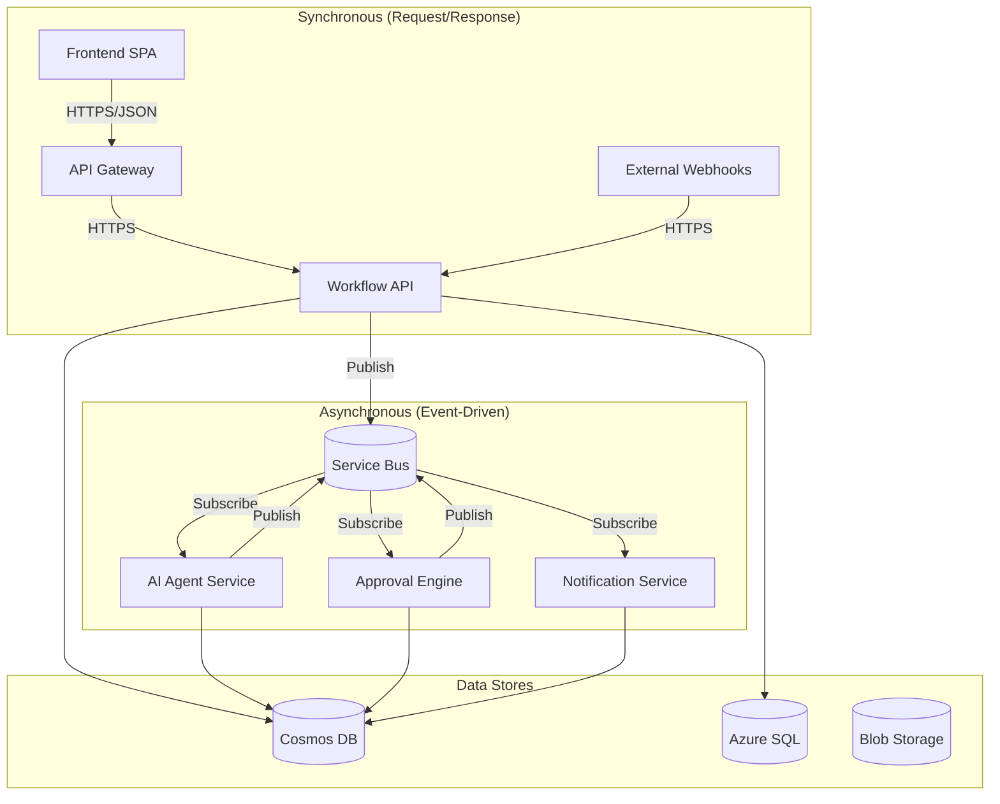
```mermaid
flowchart TB
    subgraph Synchronous["Synchronous (Request/Response)"]
        FE[Frontend SPA] -->|HTTPS/JSON| GW[API Gateway]
        GW -->|HTTPS| API[Workflow API]
        EXT[External Webhooks] -->|HTTPS| API
    end

    subgraph Asynchronous["Asynchronous (Event-Driven)"]
        API -->|Publish| BUS[(Service Bus)]
        BUS -->|Subscribe| AI[AI Agent Service]
        BUS -->|Subscribe| APR[Approval Engine]
        BUS -->|Subscribe| NTF[Notification Service]
        AI -->|Publish| BUS
        APR -->|Publish| BUS
    end

    subgraph Data["Data Stores"]
        COSMOS[(Cosmos DB)]
        SQL[(Azure SQL)]
        BLOB[(Blob Storage)]
    end

    API --> COSMOS
    API --> SQL
    AI --> COSMOS
    APR --> COSMOS
    NTF --> COSMOS
```

### Why Microservices?

- **Independent scaling**: The Notification Service may need to scale during approval surges independently from the Workflow API.
- **Independent deployment**: AI Agent Service can be updated (new models, prompts) without redeploying the core engine.
- **Fault isolation**: A failure in Slack delivery does not block workflow execution.
- **Team ownership**: Each service can be owned by a different team or developer.

---

## 4. System Architecture

### 4.1 Service Map

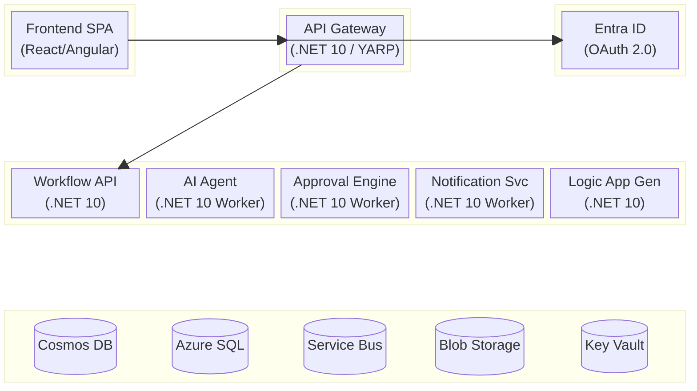
```mermaid
block-beta
    columns 5

    block:frontend:1
        SPA["Frontend SPA<br/>(React/Angular)"]
    end
    space
    block:gateway:1
        GW["API Gateway<br/>(.NET 10 / YARP)"]
    end
    space
    block:identity:1
        ID["Entra ID<br/>(OAuth 2.0)"]
    end

    space:5

    block:services:5
        WAPI["Workflow API<br/>(.NET 10)"]
        AI["AI Agent<br/>(.NET 10 Worker)"]
        APPR["Approval Engine<br/>(.NET 10 Worker)"]
        NOTIF["Notification Svc<br/>(.NET 10 Worker)"]
        LAGEN["Logic App Gen<br/>(.NET 10)"]
    end

    space:5

    block:infra:5
        COSMOS[("Cosmos DB")]
        SQLDB[("Azure SQL")]
        BUS[("Service Bus")]
        BLOB[("Blob Storage")]
        KV[("Key Vault")]
    end

    SPA --> GW
    GW --> WAPI
    SPA --> ID
```

### 4.2 Service Boundaries

| Service | Type | Responsibility | Owns Data |
|---|---|---|---|
| **Workflow API** | Web API | CRUD, execution control, template management | Workflows, Executions (Cosmos); Templates, Users (SQL) |
| **AI Agent Service** | Worker Service | LLM orchestration, prompt management, tool calling | AIAgentTasks (Cosmos) |
| **Approval Engine** | Worker Service | Approval lifecycle, timeout, escalation | ApprovalRequests, ApprovalActions (Cosmos) |
| **Notification Service** | Worker Service | Multi-channel dispatch, delivery tracking | Notifications (Cosmos) |
| **Connector Manager** | Service | Connector lifecycle: OAuth flows, credential storage, API Connection provisioning | Connectors, ConnectorCredentials (SQL); Secrets (Key Vault) |
| **Logic App Generator** | Service | ARM/Bicep generation with API Connection resolution | Generated templates (Blob) |

---

## 5. Service Descriptions

### 5.1 Workflow API

The central API service that exposes RESTful endpoints for workflow management.

**Responsibilities:**
- Workflow CRUD operations
- Workflow execution orchestration (start, pause, cancel)
- Template management
- User management
- Event publishing to Service Bus

**Key Endpoints:**

| Method | Endpoint | Description |
|---|---|---|
| `POST` | `/api/workflows` | Create a new workflow |
| `GET` | `/api/workflows/{id}` | Get workflow with steps |
| `POST` | `/api/workflows/{id}/execute` | Start workflow execution |
| `GET` | `/api/executions/{id}` | Get execution status with step details |
| `POST` | `/api/workflows/{id}/generate-logic-app` | Generate Logic App script |
| `POST` | `/api/workflows/{id}/deploy-logic-app` | Deploy Logic App to Azure |
| `GET` | `/api/approvals/pending` | List pending approvals for current user |
| `POST` | `/api/approvals/{id}/approve` | Approve a pending request |
| `POST` | `/api/approvals/{id}/reject` | Reject a pending request |
| `GET` | `/api/approvals/act` | Token-based approval action (from email links) |
| `GET` | `/api/connectors` | List all connectors with status |
| `POST` | `/api/connectors` | Create a new connector (initiates OAuth or stores API key) |
| `GET` | `/api/connectors/{id}` | Get connector details (masked credentials) |
| `DELETE` | `/api/connectors/{id}` | Delete connector and revoke credentials |
| `POST` | `/api/connectors/{id}/validate` | Validate connector credentials are still active |
| `POST` | `/api/connectors/oauth/callback` | OAuth callback endpoint (receives auth code) |
| `POST` | `/api/webhooks/slack` | Handle Slack interaction payloads |
| `POST` | `/api/webhooks/teams` | Handle Teams action payloads |

**Internal Architecture:**

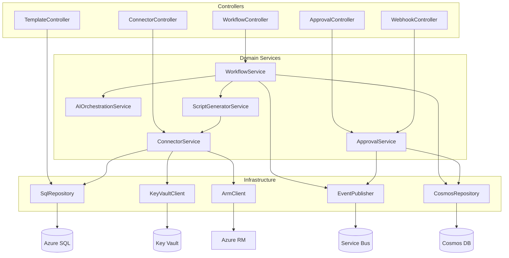
```mermaid
flowchart TB
    subgraph Controllers
        WC[WorkflowController]
        AC[ApprovalController]
        TC[TemplateController]
        CC[ConnectorController]
        WH[WebhookController]
    end

    subgraph DomainServices["Domain Services"]
        WS[WorkflowService]
        AS[ApprovalService]
        AO[AIOrchestrationService]
        SG[ScriptGeneratorService]
        CS[ConnectorService]
    end

    subgraph Infrastructure
        EP[EventPublisher]
        CR[CosmosRepository]
        SR[SqlRepository]
        KVC[KeyVaultClient]
        ARMC[ArmClient]
    end

    WC --> WS
    AC --> AS
    TC --> SR
    CC --> CS
    WH --> AS
    WS --> AO
    WS --> SG
    WS --> EP
    WS --> CR
    AS --> EP
    AS --> CR
    CS --> SR
    CS --> KVC
    CS --> ARMC
    SG --> CS
    EP --> BUS[(Service Bus)]
    CR --> COSMOS[(Cosmos DB)]
    SR --> SQL[(Azure SQL)]
    KVC --> KV[(Key Vault)]
    ARMC --> ARM[Azure RM]
```

### 5.2 AI Agent Service

A background worker service that executes AI-powered workflow steps.

**Responsibilities:**
- Consume `StepExecutionRequested` events for AI-type steps
- Manage prompt templates with variable substitution
- Call Azure OpenAI with appropriate model configuration
- Support function/tool calling for structured outputs
- Track token usage per task

**AI Execution Pipeline:**

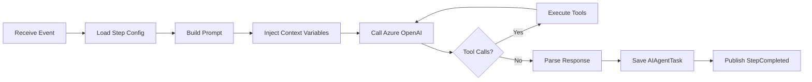
```mermaid
flowchart LR
    A[Receive Event] --> B[Load Step Config]
    B --> C[Build Prompt]
    C --> D[Inject Context Variables]
    D --> E[Call Azure OpenAI]
    E --> F{Tool Calls?}
    F -- Yes --> G[Execute Tools]
    G --> E
    F -- No --> H[Parse Response]
    H --> I[Save AIAgentTask]
    I --> J[Publish StepCompleted]
```

**Supported Step Types:**

| Step Type | Use Case | Example |
|---|---|---|
| `ContentGeneration` | Generate reports, emails, summaries | "Summarize this quarter's sales data" |
| `DecisionSupport` | Analyze data and recommend actions | "Should we approve this purchase order?" |
| `DataTransformation` | Transform/extract structured data | "Extract line items from this invoice" |
| `ConnectorMapping` | Map workflow steps to Logic App connectors | "What Logic App connectors match these steps?" |

### 5.3 Approval Engine

Manages the full lifecycle of human-in-the-loop approvals.

**Responsibilities:**
- Create approval requests with secure, single-use tokens
- Route approvals to users based on role configuration
- Handle timeout and escalation policies
- Process approvals from any channel (Web, Email, Slack, Teams)

**Approval State Machine:**

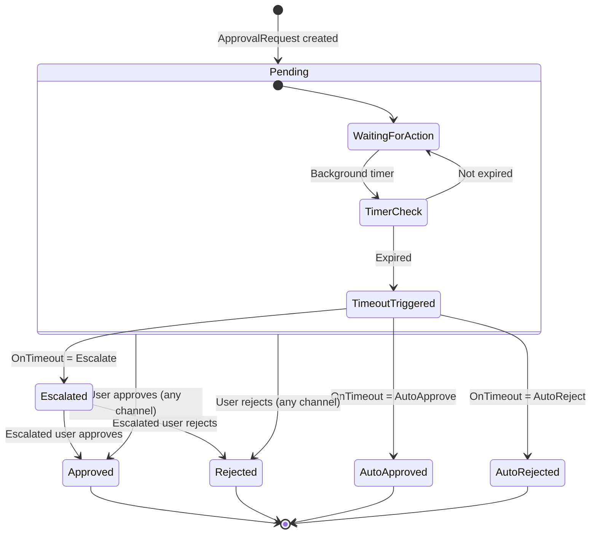
```mermaid
stateDiagram-v2
    [*] --> Pending: ApprovalRequest created

    state Pending {
        [*] --> WaitingForAction
        WaitingForAction --> TimerCheck: Background timer
        TimerCheck --> WaitingForAction: Not expired
        TimerCheck --> TimeoutTriggered: Expired
    }

    Pending --> Approved: User approves (any channel)
    Pending --> Rejected: User rejects (any channel)

    TimeoutTriggered --> Escalated: OnTimeout = Escalate
    TimeoutTriggered --> AutoApproved: OnTimeout = AutoApprove
    TimeoutTriggered --> AutoRejected: OnTimeout = AutoReject

    Escalated --> Approved: Escalated user approves
    Escalated --> Rejected: Escalated user rejects

    Approved --> [*]
    Rejected --> [*]
    AutoApproved --> [*]
    AutoRejected --> [*]
```

### 5.4 Notification Service

Dispatches notifications across multiple channels with retry and delivery tracking.

**Responsibilities:**
- Consume notification events from Service Bus
- Route to configured channels per workflow/step
- Render channel-specific templates (HTML email, Slack Block Kit, Teams Adaptive Cards)
- Track delivery status with retry logic

**Channel Adapter Pattern:**

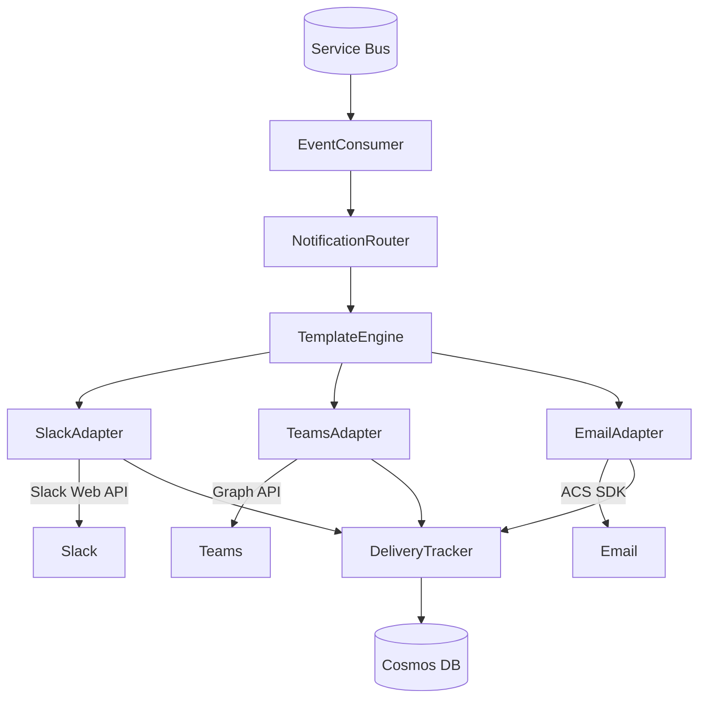
```mermaid
flowchart TB
    BUS[(Service Bus)] --> EC[EventConsumer]
    EC --> NR[NotificationRouter]
    NR --> TE[TemplateEngine]

    TE --> SA[SlackAdapter]
    TE --> TA[TeamsAdapter]
    TE --> EA[EmailAdapter]

    SA -->|Slack Web API| SLACK[Slack]
    TA -->|Graph API| TEAMS[Teams]
    EA -->|ACS SDK| EMAIL[Email]

    SA --> DT[DeliveryTracker]
    TA --> DT
    EA --> DT
    DT --> COSMOS[(Cosmos DB)]
```

**Notification Templates:**

| Channel | Format | Approval Actions |
|---|---|---|
| **Email** | HTML with inline CSS | Approve/Reject links with signed tokens |
| **Slack** | Block Kit JSON | Interactive buttons with callback |
| **Teams** | Adaptive Card JSON | Action buttons with callback |

### 5.5 Connector Manager

Manages the full lifecycle of connectors — the authenticated bridges between workflow steps and external services.

**Responsibilities:**
- Handle OAuth 2.0 consent flows (redirect, token exchange, refresh)
- Store API keys and connection strings securely in Key Vault
- Provision Azure `Microsoft.Web/connections` resources for Logic App integration
- Validate connector health and token expiry
- Rotate credentials and refresh OAuth tokens

**Connector Setup Flow:**

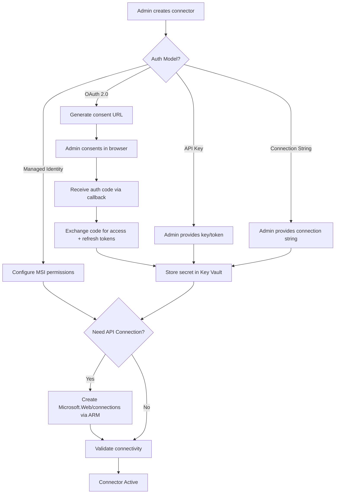
```mermaid
flowchart TB
    START[Admin creates connector] --> AUTH{Auth Model?}

    AUTH -- OAuth 2.0 --> OA1[Generate consent URL]
    OA1 --> OA2[Admin consents in browser]
    OA2 --> OA3[Receive auth code via callback]
    OA3 --> OA4[Exchange code for access + refresh tokens]
    OA4 --> STORE

    AUTH -- API Key --> AK1[Admin provides key/token]
    AK1 --> STORE

    AUTH -- Connection String --> CS1[Admin provides connection string]
    CS1 --> STORE

    AUTH -- Managed Identity --> MI1[Configure MSI permissions]
    MI1 --> PROVISION

    STORE[Store secret in Key Vault] --> PROVISION
    PROVISION{Need API Connection?}
    PROVISION -- Yes --> ARM[Create Microsoft.Web/connections via ARM]
    ARM --> VALIDATE
    PROVISION -- No --> VALIDATE
    VALIDATE[Validate connectivity] --> ACTIVE[Connector Active]
```

**Supported Connector Types:**

| Connector Type | Auth Model | API Connection | Use Case |
|---|---|---|---|
| **Office 365** | OAuth 2.0 / Service Principal | Yes | Send emails via Outlook connector |
| **Microsoft Teams** | OAuth 2.0 / Service Principal | Yes | Adaptive cards, channel messages |
| **Slack** | API Key (Bot Token) | No (HTTP action) | Slack messages with interactive buttons |
| **Azure Communication Services** | Connection String / MSI | No (SDK) | Transactional email delivery |
| **SendGrid** | API Key | Yes | Bulk email delivery |
| **Custom HTTP** | API Key / Bearer Token | No (HTTP action) | Any REST API webhook |

### 5.6 Logic App Generator

Translates workflow definitions into deployable Azure Logic App templates **with fully resolved API Connections**.

**Responsibilities:**
- Map workflow steps to Logic App connector actions
- **Resolve connectors for each step and embed `Microsoft.Web/connections` resources**
- **Inject `$connections` parameters referencing provisioned API Connections**
- Generate ARM templates (JSON) or Bicep definitions
- Include HTTP webhook triggers for approval callbacks
- Store generated templates in Blob Storage
- Deploy templates via Azure Resource Manager

**Generation Pipeline:**


```mermaid
flowchart LR
    A[Workflow Definition] --> B[Step Mapper]
    B --> C[Connector Resolver]
    C --> C1[Load Connectors from SQL]
    C1 --> C2[Resolve API Connection IDs]
    C2 --> D{AI Assist?}
    D -- Yes --> E[Azure OpenAI]
    E --> F[Optimized Mappings]
    D -- No --> F
    F --> G[Template Builder]
    G --> G1[Add Microsoft.Web/connections resources]
    G1 --> G2[Add $connections parameters]
    G2 --> H[ARM JSON / Bicep]
    H --> I[Blob Storage]
    I --> J[Deploy to Azure]
```

**Generated ARM Template Structure (with Connectors):**

```json
{
  "$schema": "https://schema.management.azure.com/schemas/2019-04-01/deploymentTemplate.json#",
  "parameters": {
    "aadClientId": { "type": "securestring" },
    "aadClientSecret": { "type": "securestring" },
    "aadTenantId": { "type": "string" },
    "slackBotToken": { "type": "securestring" }
  },
  "resources": [
    {
      "type": "Microsoft.Web/connections",
      "apiVersion": "2016-06-01",
      "name": "office365-connection",
      "location": "[resourceGroup().location]",
      "properties": {
        "api": {
          "id": "[subscriptionResourceId('Microsoft.Web/locations/managedApis', resourceGroup().location, 'office365')]"
        },
        "parameterValueType": "Alternative",
        "alternativeParameterValues": {
          "token:clientId": "[parameters('aadClientId')]",
          "token:clientSecret": "[parameters('aadClientSecret')]",
          "token:tenantId": "[parameters('aadTenantId')]",
          "token:grantType": "client_credentials"
        }
      }
    },
    {
      "type": "Microsoft.Logic/workflows",
      "apiVersion": "2019-05-01",
      "dependsOn": ["[resourceId('Microsoft.Web/connections', 'office365-connection')]"],
      "properties": {
        "parameters": {
          "$connections": {
            "value": {
              "office365": {
                "connectionId": "[resourceId('Microsoft.Web/connections', 'office365-connection')]",
                "connectionName": "office365-connection",
                "id": "[subscriptionResourceId('Microsoft.Web/locations/managedApis', resourceGroup().location, 'office365')]"
              }
            }
          }
        },
        "definition": {
          "actions": {
            "Send_Email": {
              "type": "ApiConnection",
              "inputs": {
                "host": { "connection": { "name": "@parameters('$connections')['office365']['connectionId']" } },
                "method": "post",
                "path": "/v2/Mail",
                "body": {
                  "To": "@{triggerBody()?['recipientEmail']}",
                  "Subject": "Workflow Output",
                  "Body": "@{body('AI_Agent_Step')}"
                }
              }
            },
            "Send_Slack_Notification": {
              "type": "Http",
              "inputs": {
                "method": "POST",
                "uri": "https://slack.com/api/chat.postMessage",
                "headers": {
                  "Authorization": "Bearer @{parameters('slackBotToken')}"
                },
                "body": { "channel": "#approvals", "text": "Approval needed" }
              }
            }
          }
        }
      }
    }
  ]
}
```

---

## 6. Communication Patterns

### 6.1 Domain Events

All inter-service communication happens through Azure Service Bus topics/subscriptions.

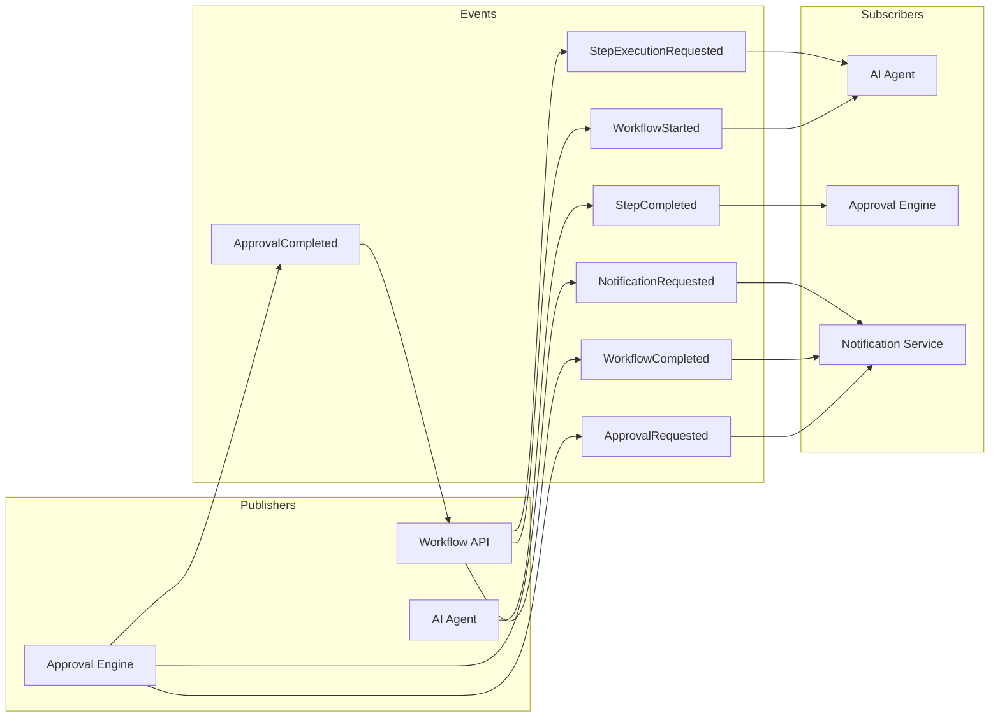
```mermaid
flowchart LR
    subgraph Events
        E1[WorkflowStarted]
        E2[StepExecutionRequested]
        E3[StepCompleted]
        E4[ApprovalRequested]
        E5[ApprovalCompleted]
        E6[WorkflowCompleted]
        E7[NotificationRequested]
    end

    subgraph Publishers
        API[Workflow API]
        AI[AI Agent]
        APR[Approval Engine]
    end

    subgraph Subscribers
        AI2[AI Agent]
        APR2[Approval Engine]
        NTF[Notification Service]
    end

    API --> E1 --> AI2
    API --> E2 --> AI2
    AI --> E3 --> APR2
    APR --> E4 --> NTF
    APR --> E5 --> API
    API --> E6 --> NTF
    APR --> E7 --> NTF
```

### 6.2 Event Contracts

```json
// WorkflowStarted
{
  "eventType": "WorkflowStarted",
  "workflowExecutionId": "guid",
  "workflowId": "guid",
  "inputData": {},
  "timestamp": "2026-03-23T10:00:00Z",
  "correlationId": "guid"
}

// ApprovalRequested
{
  "eventType": "ApprovalRequested",
  "approvalRequestId": "guid",
  "stepExecutionId": "guid",
  "title": "Review AI-generated report",
  "contextData": {},
  "channels": ["email", "slack", "teams"],
  "recipientUserIds": ["guid"],
  "expiresAt": "2026-03-24T10:00:00Z",
  "correlationId": "guid"
}

// ApprovalCompleted
{
  "eventType": "ApprovalCompleted",
  "approvalRequestId": "guid",
  "stepExecutionId": "guid",
  "action": "Approve",
  "actedByUserId": "guid",
  "channel": "Slack",
  "comment": "Looks good",
  "correlationId": "guid"
}
```

### 6.3 Service Bus Topology

| Topic | Subscriptions | Description |
|---|---|---|
| `workflow-events` | AI Agent, Approval Engine | Workflow lifecycle events |
| `step-events` | Approval Engine, Workflow API | Step completion and transition events |
| `approval-events` | Notification Service, Workflow API | Approval lifecycle events |
| `notification-events` | Notification Service | Notification dispatch requests |

---

## 7. Data Architecture

### 7.1 Storage Strategy

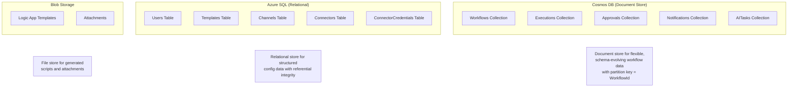
```mermaid
flowchart TB
    subgraph CosmosDB["Cosmos DB (Document Store)"]
        direction TB
        WF[Workflows Collection]
        EX[Executions Collection]
        AP[Approvals Collection]
        NT[Notifications Collection]
        AT[AITasks Collection]
    end

    subgraph SQL["Azure SQL (Relational)"]
        direction TB
        USR[Users Table]
        TPL[Templates Table]
        CH[Channels Table]
        CON[Connectors Table]
        CRED[ConnectorCredentials Table]
    end

    subgraph Blob["Blob Storage"]
        direction TB
        LA[Logic App Templates]
        ATT[Attachments]
    end

    note1["Document store for flexible,<br/>schema-evolving workflow data<br/>with partition key = WorkflowId"]
    note2["Relational store for structured<br/>config data with referential integrity"]
    note3["File store for generated<br/>scripts and attachments"]

    CosmosDB ~~~ note1
    SQL ~~~ note2
    Blob ~~~ note3
```

### 7.2 Cosmos DB Partitioning Strategy

| Collection | Partition Key | Rationale |
|---|---|---|
| `workflows` | `/id` | Each workflow is self-contained; queried by ID |
| `executions` | `/workflowId` | All executions for a workflow are co-located |
| `approvals` | `/workflowExecutionId` | Approvals queried alongside their execution |
| `notifications` | `/approvalRequestId` | Notifications grouped by approval request |
| `ai-tasks` | `/stepExecutionId` | AI tasks grouped by step execution |

### 7.3 Consistency Model

| Operation | Consistency Level | Rationale |
|---|---|---|
| Write workflow/execution | Session | User sees their own writes immediately |
| Read approval status | Strong | Prevent duplicate approvals |
| Read notifications | Eventual | Delivery status can lag slightly |
| Read dashboard aggregates | Eventual | Real-time not critical for counts |

---

## 8. AI Agent Architecture

### 8.1 Agent Design

The AI Agent follows a **ReAct (Reason + Act)** pattern with tool calling:

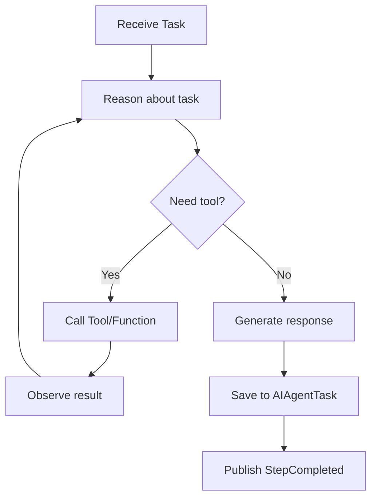
```mermaid
flowchart TB
    START[Receive Task] --> THINK[Reason about task]
    THINK --> DECIDE{Need tool?}
    DECIDE -- Yes --> TOOL[Call Tool/Function]
    TOOL --> OBSERVE[Observe result]
    OBSERVE --> THINK
    DECIDE -- No --> RESPOND[Generate response]
    RESPOND --> SAVE[Save to AIAgentTask]
    SAVE --> PUBLISH[Publish StepCompleted]
```

### 8.2 Tool Definitions

The AI Agent has access to these tools during workflow step execution:

| Tool | Description | When Used |
|---|---|---|
| `query_data` | Query business data from configured sources | Data analysis steps |
| `generate_document` | Generate formatted documents (PDF, DOCX) | Report generation steps |
| `lookup_user` | Find user info for routing/context | Approval routing steps |
| `search_knowledge` | Search internal knowledge base | Decision support steps |
| `calculate` | Perform calculations on datasets | Financial/analytical steps |

### 8.3 Prompt Management

```
┌─────────────────────────────────────────┐
│           Prompt Template               │
├─────────────────────────────────────────┤
│ System Prompt (role, constraints)       │
│ + Step Configuration (task-specific)    │
│ + Context Variables (runtime data)      │
│ + Previous Step Outputs (chain data)    │
│ + Tool Definitions (available tools)    │
└─────────────────────────────────────────┘
```

Prompts are stored as templates with variable placeholders:

```
You are a {{role}} assistant. Analyze the following data and {{action}}.

Context:
{{#each previousStepOutputs}}
- Step "{{this.stepName}}": {{this.output}}
{{/each}}

Input Data:
{{inputData}}

Constraints:
{{constraints}}
```

### 8.4 Token Budget Management

| Control | Implementation |
|---|---|
| **Per-step limit** | `Configuration.MaxTokens` on WorkflowStep |
| **Per-workflow limit** | Sum of all step limits, enforced by orchestrator |
| **Model selection** | `Configuration.Model` per step (gpt-4o for complex, gpt-4o-mini for simple) |
| **Cost tracking** | `AIAgentTask.TokensUsed` recorded per invocation |

---

## 9. Human-in-the-Loop Approval Pattern

### 9.1 Pattern Overview

The HITL pattern ensures that AI-generated outputs are reviewed by a human before the workflow proceeds. This provides:

- **Safety**: Prevents AI hallucinations from propagating downstream
- **Compliance**: Audit trail of who approved what and when
- **Control**: Business users retain final decision authority

### 9.2 Approval Flow

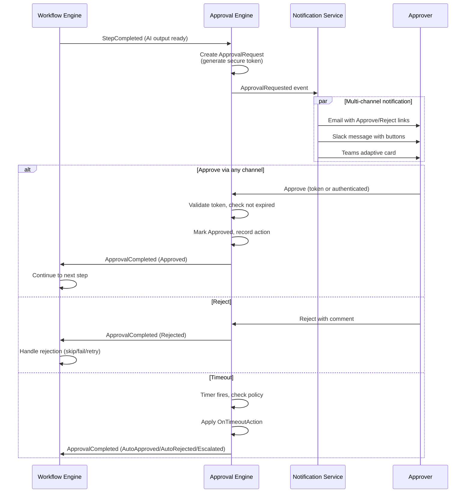
```mermaid
sequenceDiagram
    participant WF as Workflow Engine
    participant AE as Approval Engine
    participant NS as Notification Service
    participant User as Approver

    WF->>AE: StepCompleted (AI output ready)
    AE->>AE: Create ApprovalRequest<br/>(generate secure token)
    AE->>NS: ApprovalRequested event

    par Multi-channel notification
        NS->>User: Email with Approve/Reject links
        NS->>User: Slack message with buttons
        NS->>User: Teams adaptive card
    end

    alt Approve via any channel
        User->>AE: Approve (token or authenticated)
        AE->>AE: Validate token, check not expired
        AE->>AE: Mark Approved, record action
        AE->>WF: ApprovalCompleted (Approved)
        WF->>WF: Continue to next step
    else Reject
        User->>AE: Reject with comment
        AE->>WF: ApprovalCompleted (Rejected)
        WF->>WF: Handle rejection (skip/fail/retry)
    else Timeout
        AE->>AE: Timer fires, check policy
        AE->>AE: Apply OnTimeoutAction
        AE->>WF: ApprovalCompleted (AutoApproved/AutoRejected/Escalated)
    end
```

### 9.3 Token Security

Approval tokens embedded in email links follow these security rules:

| Rule | Implementation |
|---|---|
| **Uniqueness** | Cryptographically random GUID + HMAC signature |
| **Single-use** | Token invalidated after first use |
| **Expiry** | `ApprovalRequest.ExpiresAt` enforced |
| **Signed** | HMAC-SHA256 with Key Vault-managed secret |
| **Scoped** | Token encodes approvalRequestId + allowed action |

**Token URL format:**
```
https://app.example.com/api/approvals/act?token={base64(approvalId|action|expiry|hmac)}
```

---

## 10. Notification Architecture

### 10.1 Channel Configurations (via Connectors)

Each notification channel is now backed by a **Connector** that manages its authentication. Channels no longer store credentials directly — they reference a Connector, which in turn references Key Vault secrets.

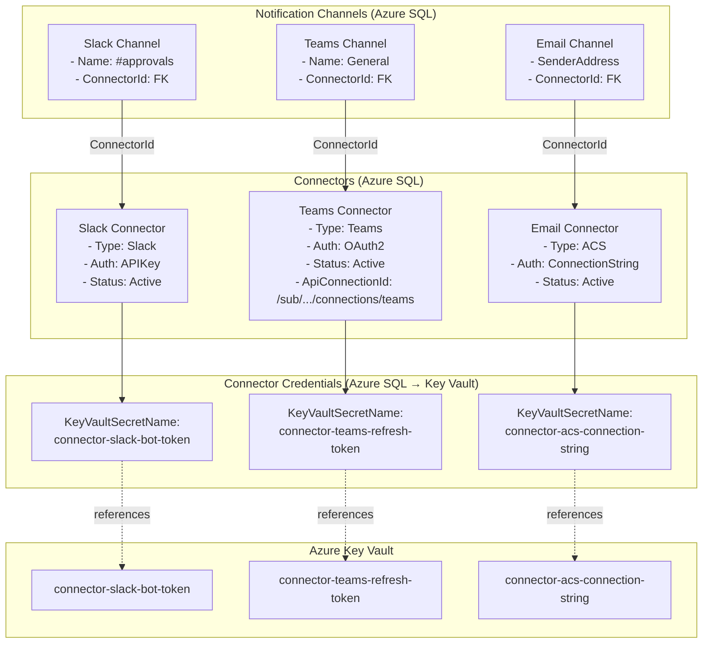
```mermaid
flowchart TB
    subgraph Channels["Notification Channels (Azure SQL)"]
        SL["Slack Channel<br/>- Name: #approvals<br/>- ConnectorId: FK"]
        TM["Teams Channel<br/>- Name: General<br/>- ConnectorId: FK"]
        EM["Email Channel<br/>- SenderAddress<br/>- ConnectorId: FK"]
    end

    subgraph Connectors["Connectors (Azure SQL)"]
        SC["Slack Connector<br/>- Type: Slack<br/>- Auth: APIKey<br/>- Status: Active"]
        TC["Teams Connector<br/>- Type: Teams<br/>- Auth: OAuth2<br/>- Status: Active<br/>- ApiConnectionId: /sub/.../connections/teams"]
        EC["Email Connector<br/>- Type: ACS<br/>- Auth: ConnectionString<br/>- Status: Active"]
    end

    subgraph Credentials["Connector Credentials (Azure SQL → Key Vault)"]
        SCR["KeyVaultSecretName:<br/>connector-slack-bot-token"]
        TCR["KeyVaultSecretName:<br/>connector-teams-refresh-token"]
        ECR["KeyVaultSecretName:<br/>connector-acs-connection-string"]
    end

    subgraph KV["Azure Key Vault"]
        S1[connector-slack-bot-token]
        S2[connector-teams-refresh-token]
        S3[connector-acs-connection-string]
    end

    SL -->|ConnectorId| SC
    TM -->|ConnectorId| TC
    EM -->|ConnectorId| EC
    SC --> SCR
    TC --> TCR
    EC --> ECR
    SCR -.->|references| S1
    TCR -.->|references| S2
    ECR -.->|references| S3
```

### Credential Resolution at Runtime

When the Notification Service needs to send a message:

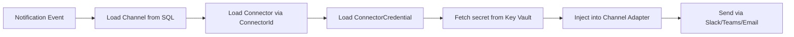
```mermaid
flowchart LR
    A[Notification Event] --> B[Load Channel from SQL]
    B --> C[Load Connector via ConnectorId]
    C --> D[Load ConnectorCredential]
    D --> E[Fetch secret from Key Vault]
    E --> F[Inject into Channel Adapter]
    F --> G[Send via Slack/Teams/Email]
```

### 10.2 Email Templates (Output Notification)

The final workflow output is delivered via email using structured HTML templates:

```
┌─────────────────────────────────────────────┐
│  📋 Workflow Completed: {WorkflowName}      │
├─────────────────────────────────────────────┤
│                                             │
│  Status: ✅ Completed                       │
│  Started: {StartedAt}                       │
│  Completed: {CompletedAt}                   │
│  Triggered by: {TriggeredBy}                │
│                                             │
│  ── Step Results ──                         │
│                                             │
│  1. {StepName} - ✅ Completed               │
│     AI Output: {summary of AI response}     │
│                                             │
│  2. {StepName} - ✅ Approved                 │
│     Approved by: {UserName} via {Channel}   │
│     Comment: {comment}                      │
│                                             │
│  3. {StepName} - ✅ Completed               │
│     Output: {step output summary}           │
│                                             │
│  ── Attachments ──                          │
│  📎 Generated-Report.pdf                    │
│  📎 Logic-App-Template.json                 │
│                                             │
└─────────────────────────────────────────────┘
```

### 10.3 Retry Strategy

| Attempt | Delay | Strategy |
|---|---|---|
| 1st retry | 30 seconds | Immediate retry for transient failures |
| 2nd retry | 2 minutes | Short backoff |
| 3rd retry | 10 minutes | Medium backoff |
| 4th retry | 1 hour | Long backoff |
| After 4 retries | — | Mark as `Failed`, log for manual review |

---

## 11. Connector Management

### 11.1 Overview

Connectors are the **authenticated bridges** between the Workflow-AI platform and external services. They solve the critical problem of credential management for:

1. **Notification delivery** — Sending via Slack, Teams, Email requires valid tokens/keys
2. **Logic App deployment** — Generated ARM templates must include `Microsoft.Web/connections` resources with valid credentials
3. **Webhook verification** — Incoming webhooks from Slack/Teams must be verified against stored signing secrets

### 11.2 Connector Data Model

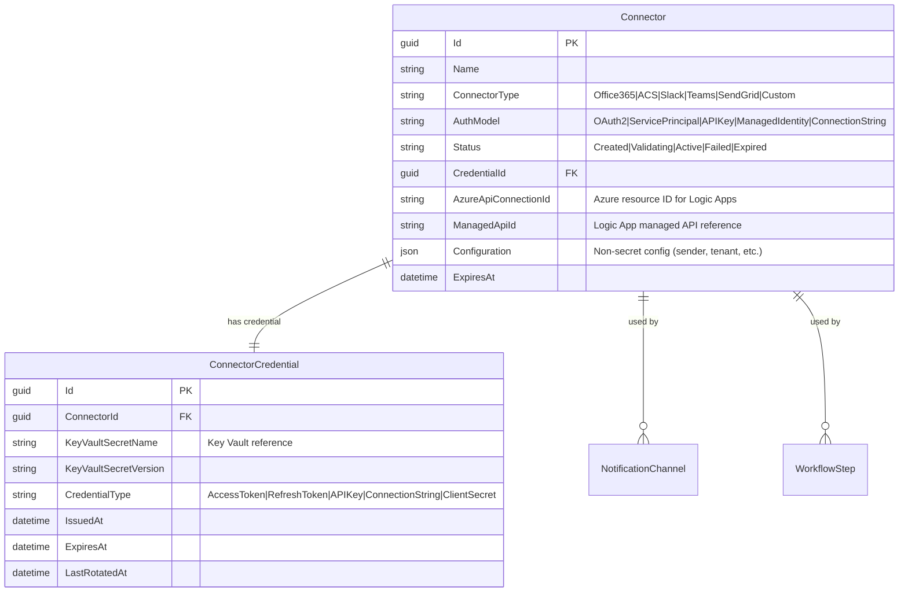
```mermaid
erDiagram
    Connector ||--|| ConnectorCredential : "has credential"
    Connector ||--o{ NotificationChannel : "used by"
    Connector ||--o{ WorkflowStep : "used by"

    Connector {
        guid Id PK
        string Name
        string ConnectorType "Office365|ACS|Slack|Teams|SendGrid|Custom"
        string AuthModel "OAuth2|ServicePrincipal|APIKey|ManagedIdentity|ConnectionString"
        string Status "Created|Validating|Active|Failed|Expired"
        guid CredentialId FK
        string AzureApiConnectionId "Azure resource ID for Logic Apps"
        string ManagedApiId "Logic App managed API reference"
        json Configuration "Non-secret config (sender, tenant, etc.)"
        datetime ExpiresAt
    }

    ConnectorCredential {
        guid Id PK
        guid ConnectorId FK
        string KeyVaultSecretName "Key Vault reference"
        string KeyVaultSecretVersion
        string CredentialType "AccessToken|RefreshToken|APIKey|ConnectionString|ClientSecret"
        datetime IssuedAt
        datetime ExpiresAt
        datetime LastRotatedAt
    }
```

### 11.3 OAuth 2.0 Flow (Office 365, Teams)

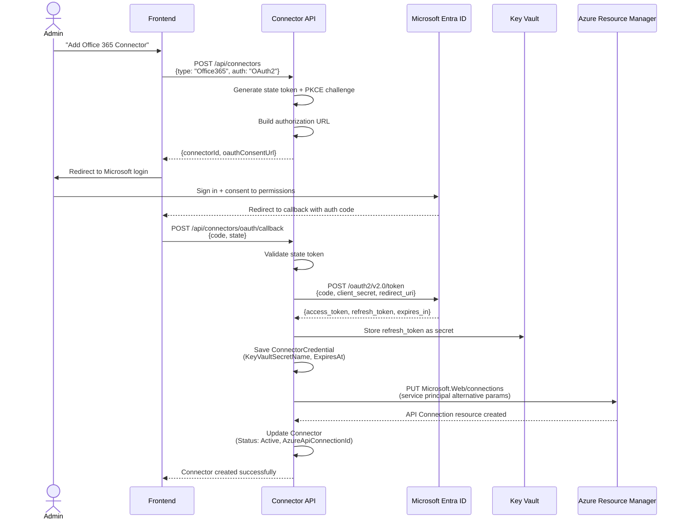
```mermaid
sequenceDiagram
    actor Admin
    participant SPA as Frontend
    participant API as Connector API
    participant Entra as Microsoft Entra ID
    participant KV as Key Vault
    participant ARM as Azure Resource Manager

    Admin->>SPA: "Add Office 365 Connector"
    SPA->>API: POST /api/connectors<br/>{type: "Office365", auth: "OAuth2"}
    API->>API: Generate state token + PKCE challenge
    API->>API: Build authorization URL
    API-->>SPA: {connectorId, oauthConsentUrl}

    SPA->>Admin: Redirect to Microsoft login
    Admin->>Entra: Sign in + consent to permissions
    Entra-->>SPA: Redirect to callback with auth code

    SPA->>API: POST /api/connectors/oauth/callback<br/>{code, state}
    API->>API: Validate state token
    API->>Entra: POST /oauth2/v2.0/token<br/>{code, client_secret, redirect_uri}
    Entra-->>API: {access_token, refresh_token, expires_in}

    API->>KV: Store refresh_token as secret
    API->>API: Save ConnectorCredential<br/>(KeyVaultSecretName, ExpiresAt)

    API->>ARM: PUT Microsoft.Web/connections<br/>(service principal alternative params)
    ARM-->>API: API Connection resource created

    API->>API: Update Connector<br/>(Status: Active, AzureApiConnectionId)
    API-->>SPA: Connector created successfully
```

### 11.4 API Key / Connection String Flow

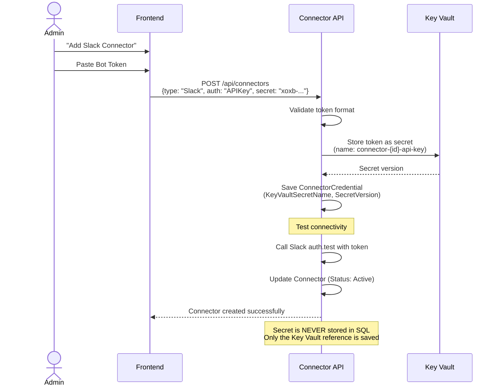
```mermaid
sequenceDiagram
    actor Admin
    participant SPA as Frontend
    participant API as Connector API
    participant KV as Key Vault

    Admin->>SPA: "Add Slack Connector"
    Admin->>SPA: Paste Bot Token
    SPA->>API: POST /api/connectors<br/>{type: "Slack", auth: "APIKey", secret: "xoxb-..."}

    API->>API: Validate token format
    API->>KV: Store token as secret<br/>(name: connector-{id}-api-key)
    KV-->>API: Secret version

    API->>API: Save ConnectorCredential<br/>(KeyVaultSecretName, SecretVersion)

    Note over API: Test connectivity
    API->>API: Call Slack auth.test with token
    API->>API: Update Connector (Status: Active)
    API-->>SPA: Connector created successfully

    Note over API: Secret is NEVER stored in SQL<br/>Only the Key Vault reference is saved
```

### 11.5 Token Refresh Strategy

For OAuth connectors, tokens must be refreshed before expiry:

| Strategy | Implementation |
|---|---|
| **Proactive refresh** | Timer trigger checks connectors expiring within 15 minutes |
| **On-demand refresh** | If runtime call gets 401, attempt token refresh before retry |
| **Refresh failure** | Mark connector as `Expired`, notify admin, fail gracefully |

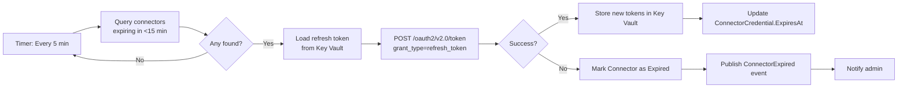
```mermaid
flowchart LR
    A[Timer: Every 5 min] --> B[Query connectors<br/>expiring in <15 min]
    B --> C{Any found?}
    C -- No --> A
    C -- Yes --> D[Load refresh token<br/>from Key Vault]
    D --> E[POST /oauth2/v2.0/token<br/>grant_type=refresh_token]
    E --> F{Success?}
    F -- Yes --> G[Store new tokens in Key Vault]
    G --> H[Update ConnectorCredential.ExpiresAt]
    F -- No --> I[Mark Connector as Expired]
    I --> J[Publish ConnectorExpired event]
    J --> K[Notify admin]
```

### 11.6 Security Considerations

| Concern | Mitigation |
|---|---|
| **Secrets never in SQL** | Only Key Vault secret names stored in database, never raw values |
| **Secret rotation** | `ConnectorCredential.LastRotatedAt` tracked; alerts on stale secrets |
| **Least privilege** | OAuth scopes limited to exactly what's needed (e.g., `Mail.Send` not `Mail.ReadWrite`) |
| **Admin-only** | Only Admin role can create/modify connectors |
| **Audit trail** | All connector operations logged with user + timestamp |
| **PKCE** | OAuth flows use PKCE (Proof Key for Code Exchange) to prevent auth code interception |

---

## 12. Logic App Script Generation

### 11.1 Mapping Rules

Workflow steps are mapped to Logic App constructs:

| Workflow Step Type | Logic App Construct |
|---|---|
| `AIAgent` | HTTP action (call AI Agent endpoint) |
| `HumanApproval` | HTTP webhook action (wait for callback) |
| `Notification` | Connector action (Outlook, Slack, Teams) |
| `Action` | Mapped to appropriate connector |
| `Condition` | Condition action with expressions |
| `Loop` | For-each or Until loop |

### 11.2 Generated ARM Template Structure

```json
{
  "$schema": "https://schema.management.azure.com/schemas/2019-04-01/deploymentTemplate.json#",
  "resources": [{
    "type": "Microsoft.Logic/workflows",
    "apiVersion": "2019-05-01",
    "properties": {
      "definition": {
        "$schema": "https://schema.management.azure.com/providers/Microsoft.Logic/schemas/2016-06-01/workflowdefinition.json#",
        "triggers": {
          "manual": { "type": "Request", "kind": "Http" }
        },
        "actions": {
          "AI_Agent_Step": {
            "type": "Http",
            "inputs": { "method": "POST", "uri": "@parameters('aiAgentEndpoint')" }
          },
          "Wait_For_Approval": {
            "type": "HttpWebhook",
            "inputs": {
              "subscribe": { "method": "POST", "uri": "@parameters('approvalWebhookUri')" },
              "unsubscribe": {}
            }
          },
          "Send_Result_Email": {
            "type": "ApiConnection",
            "inputs": { "host": { "connection": { "name": "@parameters('$connections')['office365']" } } }
          }
        }
      }
    }
  }]
}
```

---

## 13. Security Architecture

### 13.1 Authentication & Authorization

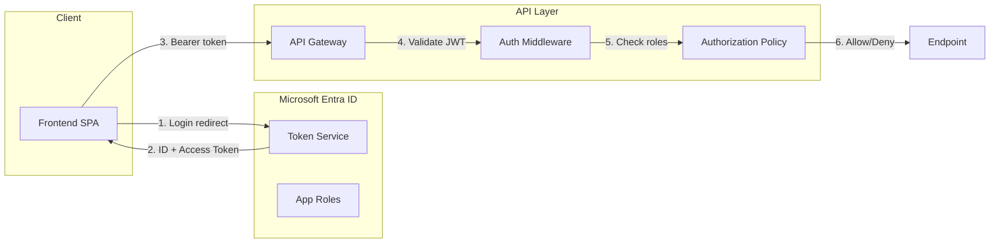
```mermaid
flowchart LR
    subgraph Client
        SPA[Frontend SPA]
    end

    subgraph Auth["Microsoft Entra ID"]
        TOKEN[Token Service]
        RBAC[App Roles]
    end

    subgraph API["API Layer"]
        GW[API Gateway]
        MW[Auth Middleware]
        AUTHZ[Authorization Policy]
    end

    SPA -->|1. Login redirect| TOKEN
    TOKEN -->|2. ID + Access Token| SPA
    SPA -->|3. Bearer token| GW
    GW -->|4. Validate JWT| MW
    MW -->|5. Check roles| AUTHZ
    AUTHZ -->|6. Allow/Deny| API_ENDPOINT[Endpoint]
```

### 13.2 Role-Based Access Control

| Role | Permissions |
|---|---|
| **Admin** | Full access: manage workflows, templates, channels, users |
| **Approver** | View workflows, approve/reject assigned requests, view executions |
| **Viewer** | Read-only access to workflows and executions |

### 13.3 Security Controls

| Control | Implementation |
|---|---|
| **Authentication** | Entra ID with OAuth 2.0 / OIDC |
| **API Authorization** | JWT validation + role-based policies |
| **Secrets Management** | Azure Key Vault for all connection strings, tokens, API keys |
| **Webhook Verification** | Slack signing secret (HMAC-SHA256), Teams HMAC validation |
| **Approval Token Security** | Single-use, time-limited, HMAC-signed tokens |
| **Data Encryption** | TLS 1.3 in transit, Azure-managed encryption at rest |
| **Network Security** | Private endpoints for Cosmos DB, SQL, Service Bus |
| **Audit Trail** | Every approval action logged with user, channel, timestamp |

---

## 14. Infrastructure & Deployment

### 14.1 Azure Resource Map

```mermaid
flowchart TB
    subgraph RG["Resource Group: workflow-ai-rg"]
        subgraph Compute["Compute"]
            AKS["AKS Cluster<br/>- Workflow API pod<br/>- AI Agent pod<br/>- Approval Engine pod<br/>- Notification Service pod<br/>- Logic App Generator pod"]
            SWA["Static Web Apps<br/>- Frontend SPA"]
        end

        subgraph Data["Data"]
            COSMOS["Cosmos DB Account<br/>- Serverless tier<br/>- 5 containers"]
            SQL["Azure SQL Server<br/>- Serverless tier<br/>- Single database"]
            BUS["Service Bus Namespace<br/>- Premium tier<br/>- 4 topics"]
            BLOB["Storage Account<br/>- Blob containers"]
        end

        subgraph Security["Security & Networking"]
            KV["Key Vault"]
            APIM["API Management<br/>- Developer/Standard tier"]
            VNET["Virtual Network<br/>- Private endpoints"]
        end

        subgraph Monitoring["Monitoring"]
            AI_INSIGHTS["Application Insights"]
            LA_WORKSPACE["Log Analytics Workspace"]
            MONITOR["Azure Monitor<br/>- Alert rules"]
        end
    end

    AKS --> COSMOS
    AKS --> SQL
    AKS --> BUS
    AKS --> BLOB
    AKS --> KV
    APIM --> AKS
    SWA --> APIM
    AKS --> AI_INSIGHTS
```

### 14.2 AKS Pod Configuration

| Pod | Replicas (Min/Max) | CPU Request | Memory Request |
|---|---|---|---|
| Workflow API | 2 / 5 | 250m | 512Mi |
| AI Agent Service | 1 / 3 | 500m | 1Gi |
| Approval Engine | 1 / 3 | 250m | 512Mi |
| Notification Service | 1 / 5 | 250m | 512Mi |
| Logic App Generator | 1 / 2 | 250m | 512Mi |

### 14.3 CI/CD Pipeline

```mermaid
flowchart LR
    A[Git Push] --> B[Build & Test]
    B --> C[Docker Build]
    C --> D[Push to ACR]
    D --> E{Branch?}
    E -- main --> F[Deploy to Staging]
    F --> G[Integration Tests]
    G --> H[Manual Approval]
    H --> I[Deploy to Production]
    E -- feature/* --> J[Deploy to Dev]
```

---

## 15. Observability

### 15.1 Distributed Tracing

All services propagate a `correlationId` through:
- HTTP headers (`X-Correlation-Id`)
- Service Bus message properties
- Cosmos DB operations
- Log entries

This enables end-to-end tracing of a workflow execution across all services.

### 15.2 Structured Logging

```json
{
  "timestamp": "2026-03-23T10:30:00Z",
  "level": "Information",
  "correlationId": "abc-123",
  "service": "ApprovalEngine",
  "event": "ApprovalCompleted",
  "properties": {
    "approvalRequestId": "def-456",
    "action": "Approve",
    "channel": "Slack",
    "userId": "ghi-789",
    "durationMs": 45200
  }
}
```

### 15.3 Key Metrics & Alerts

| Metric | Alert Threshold | Severity |
|---|---|---|
| Workflow execution failure rate | > 5% in 15 min | Critical |
| Approval request timeout rate | > 20% in 1 hour | Warning |
| Notification delivery failure | > 10% in 15 min | Warning |
| AI Agent response time (p95) | > 30 seconds | Warning |
| Service Bus dead-letter count | > 0 | Warning |
| API response time (p99) | > 2 seconds | Warning |

### 15.4 Health Checks

Each service exposes `/health` and `/health/ready` endpoints:

| Check | What it verifies |
|---|---|
| `cosmos-db` | Cosmos DB connectivity and read access |
| `azure-sql` | SQL database connectivity |
| `service-bus` | Service Bus namespace connectivity |
| `azure-openai` | OpenAI endpoint reachability |
| `key-vault` | Key Vault access |

---

## 16. Cross-Cutting Concerns

### 16.1 Resilience Patterns

| Pattern | Implementation | Where Applied |
|---|---|---|
| **Retry** | Polly retry policies with exponential backoff | HTTP clients, Service Bus, Cosmos DB |
| **Circuit Breaker** | Polly circuit breaker (5 failures → 30s open) | Azure OpenAI, external channel APIs |
| **Timeout** | HTTP client timeout + cancellation tokens | All external calls |
| **Bulkhead** | Separate HttpClient instances per dependency | Slack, Teams, Email adapters |
| **Dead Letter** | Service Bus dead-letter queue + alerting | All message consumers |

### 16.2 Idempotency

All event handlers check for duplicate processing:

```
1. Receive message with messageId
2. Check if messageId exists in processed-messages store
3. If exists → acknowledge and skip
4. If not → process, then store messageId
5. Acknowledge message
```

### 16.3 Configuration Management

| Config Type | Source | Example |
|---|---|---|
| App settings | Azure App Configuration | Feature flags, service URLs |
| Secrets | Azure Key Vault | API keys, connection strings |
| Per-tenant config | Azure SQL | Notification channels, templates |
| Runtime config | Cosmos DB | Workflow definitions, step configs |

---

## 17. Architecture Decision Records (ADRs)

### ADR-001: Cosmos DB for Workflow Data

**Context:** Workflow definitions and executions have flexible, evolving schemas with nested step configurations.

**Decision:** Use Azure Cosmos DB (NoSQL) for workflow-related data.

**Rationale:**
- Flexible schema supports varying step configurations without migrations
- Hierarchical data (workflow → steps → executions) maps naturally to documents
- Partition by workflowId enables efficient queries
- Serverless tier reduces cost for variable workloads

**Alternatives considered:** Azure SQL (rejected: rigid schema for varying step configs), Table Storage (rejected: limited querying)

---

### ADR-002: Azure Service Bus for Inter-Service Communication

**Context:** Services need to communicate asynchronously with guaranteed delivery.

**Decision:** Use Azure Service Bus topics/subscriptions for event-driven communication.

**Rationale:**
- Guaranteed message delivery with dead-letter support
- Topic/subscription model enables pub/sub with multiple consumers
- Session support for ordered processing when needed
- Premium tier provides network isolation via private endpoints

**Alternatives considered:** Azure Event Grid (rejected: less control over retry/DLQ), RabbitMQ on AKS (rejected: operational overhead)

---

### ADR-003: Multi-Channel Approval via Webhooks

**Context:** Users need to approve from whichever channel is most convenient.

**Decision:** Support approval from Web UI, Email (token links), Slack (interactive buttons), and Teams (adaptive card actions).

**Rationale:**
- Reduces approval latency by meeting users where they already are
- Webhook callbacks from Slack/Teams converge on the same API endpoint
- Email tokens provide a fallback for users without Slack/Teams access

**Alternatives considered:** Web-only approval (rejected: too slow, low engagement), Dedicated mobile app (rejected: too much investment for initial release)

---

### ADR-004: Separate Logic App Generator Service

**Context:** Logic App script generation is a specialized, compute-intensive task that includes optional AI assistance.

**Decision:** Isolate Logic App generation into its own service.

**Rationale:**
- Generation logic is complex and evolves independently
- AI-assisted connector mapping may require long-running LLM calls
- Generated artifacts (ARM/Bicep) are stored as files, not runtime data
- Keeps the core Workflow API focused on execution

**Alternatives considered:** Embedded in Workflow API (rejected: bloats API with generation logic), Azure Function (rejected: cold start issues for large template generation)

---

### ADR-005: AKS over Azure Container Apps

**Context:** Need a container orchestration platform for deploying .NET 10 services.

**Decision:** Use Azure Kubernetes Service (AKS).

**Rationale:**
- Full control over networking (private endpoints, ingress, egress)
- Mature ecosystem for service mesh, monitoring, and scaling
- Team has existing Kubernetes expertise
- Supports complex deployment strategies (canary, blue-green)

**Alternatives considered:** Azure Container Apps (viable for simpler setups but less control over networking and scaling policies), Azure App Service (rejected: limited scaling for worker services)

---

### ADR-006: Connector Management with Key Vault-backed Credentials

**Context:** Logic Apps require `Microsoft.Web/connections` (API Connection) resources with valid credentials to interact with external services (Office 365, Slack, Teams, etc.). Notification channels also need authenticated access. Storing credentials directly in SQL or configuration is a security risk.

**Decision:** Introduce a Connector Management subsystem with:
- `Connector` and `ConnectorCredential` entities in Azure SQL (metadata only)
- All secrets stored exclusively in Azure Key Vault
- Azure API Connection resources provisioned via ARM for Logic App integration
- OAuth 2.0 flows handled server-side with PKCE
- Proactive token refresh via timer triggers

**Rationale:**
- **Security**: Secrets never leave Key Vault; SQL stores only Key Vault references
- **Logic App compatibility**: Generated ARM templates include `Microsoft.Web/connections` resources that reference provisioned API Connections
- **Unified model**: Both notification channels and Logic App steps use the same Connector entity for authentication
- **Credential lifecycle**: Token refresh, rotation, and expiry are handled centrally
- **Audit**: All connector operations are logged for compliance

**Alternatives considered:**
- Store credentials encrypted in SQL (rejected: Key Vault provides better security, rotation, and access policies)
- Let Logic Apps manage their own connections via portal (rejected: breaks automation, not reproducible in ARM)
- Use Azure Managed Connectors only (rejected: limits to connectors available in Logic Apps, no support for Slack Bot API or custom HTTP with specific auth)

---

### ADR-007: Hybrid Connector Strategy for V1

**Context:** Full OAuth connector support for all channels is complex. Need to ship a working V1 quickly.

**Decision:** Use a hybrid approach for V1:

| Channel | V1 Strategy | Auth Model | API Connection |
|---|---|---|---|
| Email (ACS) | HTTP action + connection string | Connection String | No |
| Slack | HTTP action + bot token | API Key | No |
| Teams (webhook) | HTTP action + webhook URL | API Key | No |
| Office 365 (rich) | Full API Connection + service principal | OAuth 2.0 / SP | Yes |
| Teams (rich) | Full API Connection + service principal | OAuth 2.0 / SP | Yes |

**Rationale:**
- API Key/Connection String connectors cover the most common notification use cases without OAuth complexity
- Full OAuth with API Connection provisioning is only needed for Logic App connectors that use managed APIs (Office 365, Teams rich integration)
- This allows V1 to ship with working notifications while OAuth support is built incrementally

---

*For the C4 diagrams (System Context, Container, Component, Sequence, Data Model), see [C4-Architecture.md](./C4-Architecture.md).*

*For implementation tasks and timeline, see [Implementation-Tasks.md](./Implementation-Tasks.md).*
