# Workflow-AI: Dynamic Workflow with AI Agent & Human-in-the-Loop

## C4 Architecture Documentation

> **Tech Stack:** .NET 10, Azure Services (Logic Apps, Service Bus, Functions, Cosmos DB, PostgreSQL, Communication Services)
> **Pattern:** AI Agent with Human-in-the-Loop Approval

---

## 1. System Context Diagram (C4 Level 1)

The highest-level view showing the Workflow-AI system and its interactions with external actors and systems.

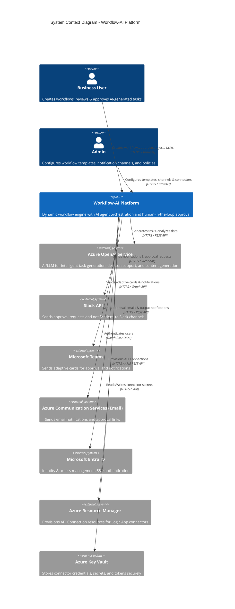

### Context Summary

| Actor / System | Role | Integration |
|---|---|---|
| **Business User** | Initiates workflows, approves/rejects AI-generated steps | Web UI, Email links, Slack/Teams actions |
| **Admin** | Configures templates, notification channels, connectors, policies | Web UI |
| **Azure Resource Manager** | Provisions API Connection resources for Logic App connectors | ARM REST API |
| **Azure OpenAI** | AI backbone for task generation and decision support | REST API |
| **Slack** | Notification & approval channel | Webhooks / Slack API |
| **Microsoft Teams** | Notification & approval channel | Graph API / Adaptive Cards |
| **Email (ACS)** | Output delivery & approval notifications | Azure Communication Services |
| **Entra ID** | Identity provider | OAuth 2.0 / OIDC |

---

## 2. Container Diagram (C4 Level 2)

Shows the high-level technology choices and how containers interact within the Workflow-AI system.

```mermaid
C4Container
    title Container Diagram - Workflow-AI Platform

    Person(user, "Business User", "Approves tasks, monitors workflows")

    System_Boundary(workflowPlatform, "Workflow-AI Platform") {
        Container(spa, "Frontend SPA", "React / Angular", "Workflow designer, dashboard, approval UI")
        Container(apiGateway, "API Gateway", ".NET 10 / YARP", "Routes requests, rate limiting, auth validation")
        Container(workflowAPI, "Workflow API", ".NET 10 Web API", "Workflow CRUD, execution control, user management")
        Container(aiAgentService, "AI Agent Service", ".NET 10 Worker", "Orchestrates AI agent tasks, prompt engineering, tool calling")
        Container(approvalEngine, "Approval Engine", ".NET 10 Worker", "Manages human-in-the-loop approval lifecycle")
        Container(notificationService, "Notification Service", ".NET 10 Worker", "Multi-channel notification dispatch (Slack, Teams, Email)")
        Container(logicAppGenerator, "Logic App Generator", ".NET 10 Service", "Generates & deploys Azure Logic App ARM/Bicep scripts with API Connections")
        Container(connectorManager, "Connector Manager", ".NET 10 Service", "Manages connector lifecycle: OAuth flows, API key storage, API Connection provisioning")
        ContainerDb(cosmosDB, "Cosmos DB", "Azure Cosmos DB (NoSQL)", "Tasks, approvals, audit logs")
        ContainerDb(sqlDB, "PostgreSQL", "Azure Database for PostgreSQL", "User profiles, templates, channel configs, connectors")
        Container(serviceBus, "Service Bus", "Azure Service Bus", "Async messaging between services (events, commands)")
        Container(blobStorage, "Blob Storage", "Azure Blob Storage", "Generated Logic App scripts, attachments, exports")
        Container(keyVault, "Key Vault", "Azure Key Vault", "Connector credentials, API keys, secrets, tokens")
    }

    System_Ext(azureOpenAI, "Azure OpenAI", "LLM for AI agent")
    System_Ext(slackAPI, "Slack API", "Notifications")
    System_Ext(teamsAPI, "MS Teams", "Notifications")
    System_Ext(emailACS, "Azure Communication Services", "Email")
    System_Ext(azureARM, "Azure Resource Manager", "API Connection provisioning")

    Rel(user, spa, "Uses", "HTTPS")
    Rel(spa, apiGateway, "API calls", "HTTPS/JSON")
    Rel(apiGateway, workflowAPI, "Routes to", "HTTPS")
    Rel(workflowAPI, cosmosDB, "Reads/Writes workflows", "SDK")
    Rel(workflowAPI, sqlDB, "Reads/Writes config", "EF Core")
    Rel(workflowAPI, serviceBus, "Publishes events", "AMQP")
    Rel(workflowAPI, logicAppGenerator, "Requests script generation", "HTTPS")
    Rel(aiAgentService, azureOpenAI, "Calls LLM", "HTTPS")
    Rel(aiAgentService, serviceBus, "Consumes/Publishes", "AMQP")
    Rel(aiAgentService, cosmosDB, "Reads/Writes tasks", "SDK")
    Rel(approvalEngine, serviceBus, "Consumes approval events", "AMQP")
    Rel(approvalEngine, cosmosDB, "Reads/Writes approvals", "SDK")
    Rel(approvalEngine, notificationService, "Triggers notifications", "Service Bus")
    Rel(notificationService, slackAPI, "Sends", "HTTPS")
    Rel(notificationService, teamsAPI, "Sends", "HTTPS")
    Rel(notificationService, emailACS, "Sends", "HTTPS")
    Rel(logicAppGenerator, blobStorage, "Stores scripts", "SDK")
    Rel(logicAppGenerator, connectorManager, "Resolves connectors for steps", "Internal")
    Rel(connectorManager, keyVault, "Reads/Writes secrets", "SDK")
    Rel(connectorManager, sqlDB, "Reads/Writes connector configs", "EF Core")
    Rel(connectorManager, azureARM, "Provisions API Connection resources", "HTTPS")
    Rel(notificationService, keyVault, "Reads channel credentials", "SDK")

    UpdateLayoutConfig($c4ShapeInRow="4", $c4BoundaryInRow="1")
```

### Container Summary

| Container | Technology | Purpose |
|---|---|---|
| **Frontend SPA** | React or Angular | Workflow designer, approval UI, dashboards |
| **API Gateway** | .NET 10 / YARP | Request routing, authentication, rate limiting |
| **Workflow API** | .NET 10 Web API | Core CRUD, workflow execution orchestration |
| **AI Agent Service** | .NET 10 Worker Service | AI task orchestration, prompt management, tool calling |
| **Approval Engine** | .NET 10 Worker Service | Human-in-the-loop approval lifecycle |
| **Notification Service** | .NET 10 Worker Service | Multi-channel notification dispatch |
| **Logic App Generator** | .NET 10 Service | Generates ARM/Bicep templates for Azure Logic Apps with API Connections |
| **Connector Manager** | .NET 10 Service | Manages connector lifecycle: OAuth flows, credentials, API Connection provisioning |
| **Cosmos DB** | Azure Cosmos DB | Tasks, approvals, audit trail |
| **PostgreSQL** | Azure Database for PostgreSQL | User profiles, templates, channel configurations, connectors |
| **Key Vault** | Azure Key Vault | Connector credentials, API keys, signing secrets |
| **Service Bus** | Azure Service Bus | Event-driven async communication |
| **Blob Storage** | Azure Blob Storage | Generated scripts, attachments |

---

## 3. Component Diagram (C4 Level 3) — Workflow API

```mermaid
C4Component
    title Component Diagram - Workflow API

    Container_Boundary(api, "Workflow API (.NET 10)") {
        Component(workflowController, "WorkflowController", "API Controller", "REST endpoints for workflow CRUD & execution")
        Component(approvalController, "ApprovalController", "API Controller", "REST endpoints for approval actions (approve/reject)")
        Component(templateController, "TemplateController", "API Controller", "Manage workflow templates")
        Component(connectorController, "ConnectorController", "API Controller", "Connector CRUD, OAuth callback, validation, provisioning")
        Component(workflowService, "WorkflowService", "Domain Service", "Workflow orchestration & state machine logic")
        Component(approvalService, "ApprovalService", "Domain Service", "Approval lifecycle, escalation, timeout handling")
        Component(aiOrchestrator, "AIOrchestrationService", "Domain Service", "Coordinates AI agent execution & tool calling")
        Component(scriptGenerator, "ScriptGeneratorService", "Domain Service", "Generates Logic App JSON/Bicep definitions with API Connections")
        Component(connectorService, "ConnectorService", "Domain Service", "Connector lifecycle: OAuth exchange, credential storage, API Connection provisioning")
        Component(eventPublisher, "EventPublisher", "Infrastructure", "Publishes domain events to Service Bus")
        Component(cosmosRepo, "CosmosRepository", "Infrastructure", "Data access for Cosmos DB")
        Component(sqlRepo, "SqlRepository", "Infrastructure", "Data access for PostgreSQL via EF Core")
        Component(keyVaultClient, "KeyVaultClient", "Infrastructure", "Reads/Writes secrets to Azure Key Vault")
        Component(armClient, "ArmClient", "Infrastructure", "Provisions Azure API Connection resources via ARM")
    }

    ContainerDb(cosmosDB, "Cosmos DB", "Tasks, Approvals")
    ContainerDb(sqlDB, "PostgreSQL", "Users, Templates, Configs, Connectors")
    Container(serviceBus, "Service Bus", "Event messaging")
    Container(keyVault, "Key Vault", "Secrets")
    System_Ext(azureOpenAI, "Azure OpenAI", "LLM")
    System_Ext(azureARM, "Azure Resource Manager", "API Connection provisioning")

    Rel(workflowController, workflowService, "Uses")
    Rel(approvalController, approvalService, "Uses")
    Rel(templateController, sqlRepo, "Uses")
    Rel(connectorController, connectorService, "Uses")
    Rel(workflowService, aiOrchestrator, "Triggers AI agent")
    Rel(workflowService, scriptGenerator, "Generates scripts")
    Rel(workflowService, eventPublisher, "Publishes events")
    Rel(workflowService, cosmosRepo, "Persists workflows")
    Rel(approvalService, eventPublisher, "Publishes approval events")
    Rel(approvalService, cosmosRepo, "Persists approvals")
    Rel(connectorService, sqlRepo, "Persists connector configs")
    Rel(connectorService, keyVaultClient, "Stores/retrieves secrets")
    Rel(connectorService, armClient, "Provisions API Connections")
    Rel(scriptGenerator, connectorService, "Resolves connectors for steps")
    Rel(aiOrchestrator, azureOpenAI, "Calls LLM", "HTTPS")
    Rel(eventPublisher, serviceBus, "Sends messages", "AMQP")
    Rel(cosmosRepo, cosmosDB, "Reads/Writes", "SDK")
    Rel(sqlRepo, sqlDB, "Reads/Writes", "EF Core")
    Rel(keyVaultClient, keyVault, "Reads/Writes", "SDK")
    Rel(armClient, azureARM, "Provisions resources", "HTTPS")
```

---

## 4. Component Diagram (C4 Level 3) — Notification Service

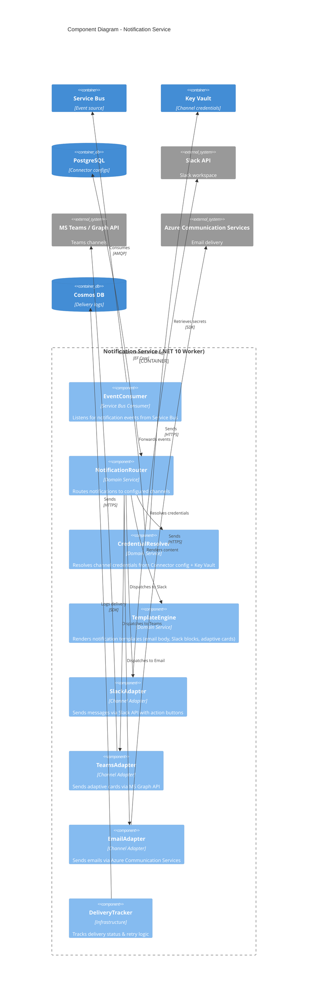

---

## 5. Data Model (Entity Relationship Diagram)

This data model serves the frontend and drives the workflow engine.

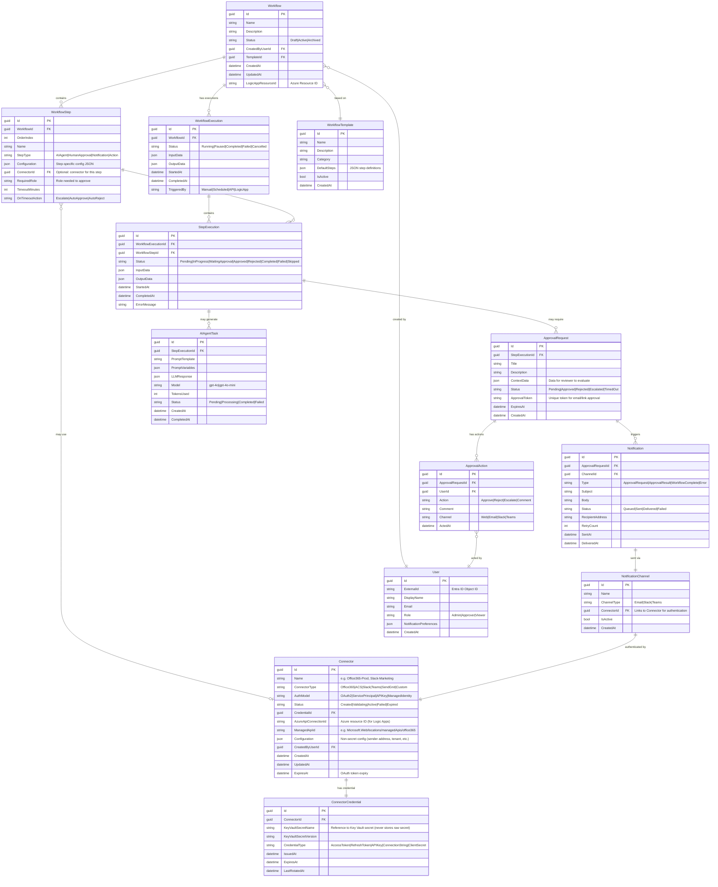

### Key Data Model Concepts

| Entity | Purpose | Storage |
|---|---|---|
| **Workflow** | Definition of a workflow with its steps | Blob Storage |
| **WorkflowTemplate** | Reusable workflow blueprints | PostgreSQL |
| **WorkflowStep** | Individual step definition (AI, Approval, Notification) | Blob Storage |
| **WorkflowExecution** | Runtime instance of a workflow | Cosmos DB |
| **StepExecution** | Runtime state of each step | Cosmos DB |
| **ApprovalRequest** | Human-in-the-loop approval with token-based access | Cosmos DB |
| **ApprovalAction** | Audit trail of approval decisions | Cosmos DB |
| **AIAgentTask** | AI/LLM execution record with token tracking | Cosmos DB |
| **Notification** | Notification delivery record with retry tracking | Cosmos DB |
| **NotificationChannel** | Channel configuration linked to Connector for auth | PostgreSQL |
| **Connector** | Connector definition (type, auth model, Azure API Connection reference) | PostgreSQL |
| **ConnectorCredential** | Key Vault secret pointer (never stores raw secrets) | PostgreSQL |
| **User** | User profile linked to Entra ID | PostgreSQL |

---

## 6. Sequence Diagram — Workflow Execution with Human-in-the-Loop

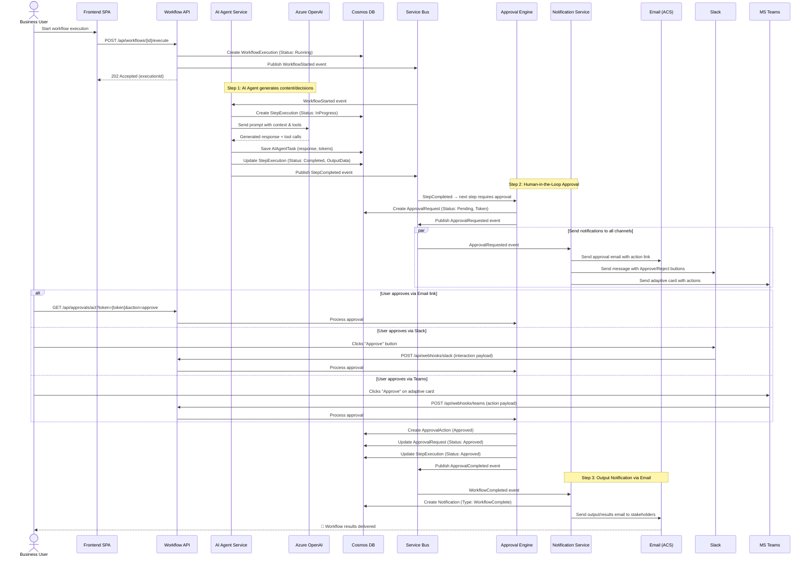

---

## 7. Sequence Diagram — Logic App Script Generation

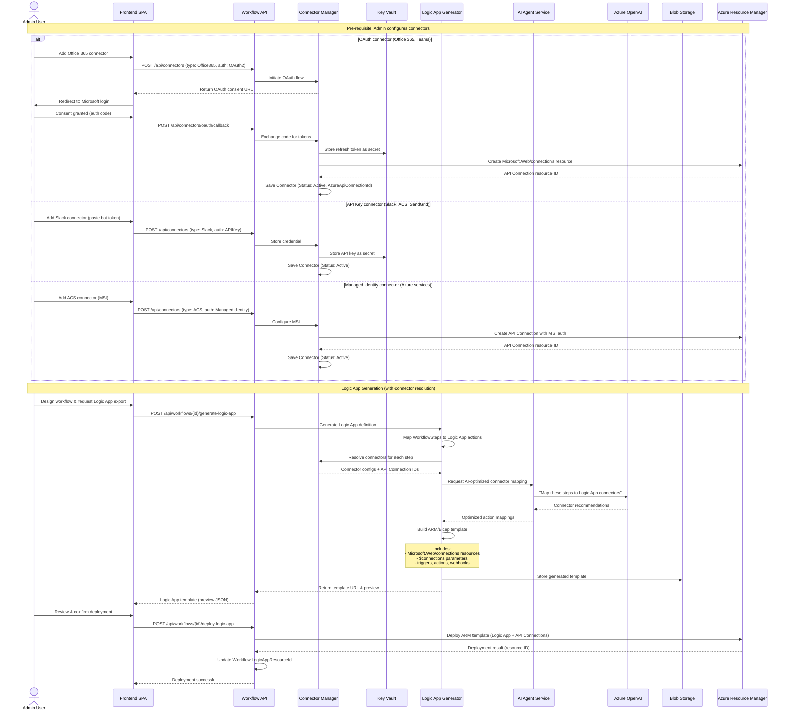

---

## 8. Approval Timeout & Escalation Flow

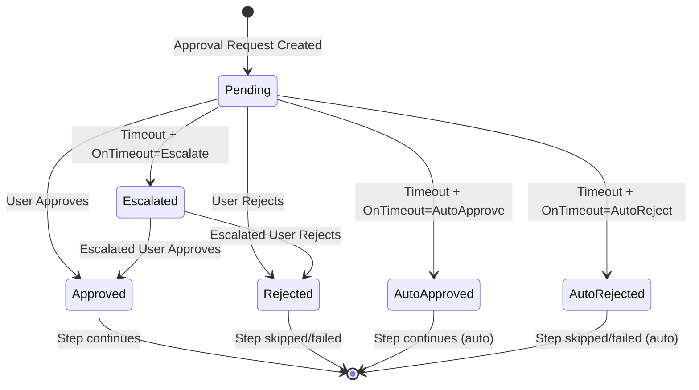

---

## 9. Connector Lifecycle State Diagram

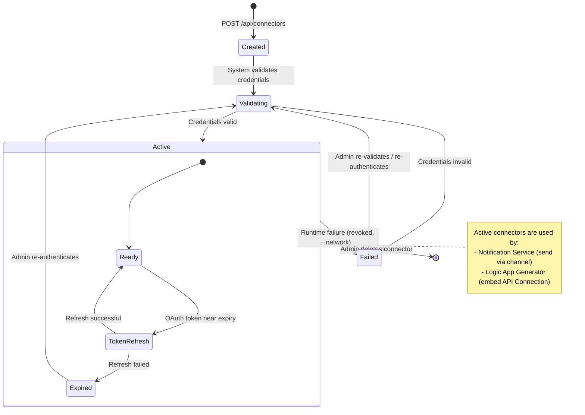

### Connector Authentication Models

| Auth Model | Flow | Token Storage | API Connection |
|---|---|---|---|
| **OAuth 2.0** | Admin consents via browser → auth code → token exchange | Refresh token in Key Vault | `Microsoft.Web/connections` with `parameterValueType: Alternative` |
| **Service Principal** | App registration with client_id + client_secret | Client secret in Key Vault | `Microsoft.Web/connections` with service principal params |
| **API Key** | Admin pastes key/token directly | Key in Key Vault | N/A — uses HTTP action with `Authorization` header |
| **Connection String** | Admin pastes connection string | Connection string in Key Vault | N/A — uses SDK directly |
| **Managed Identity** | No secret needed — uses Azure MSI | No secret stored | `Microsoft.Web/connections` with MSI `identity` block |

---

## 10. Deployment Diagram

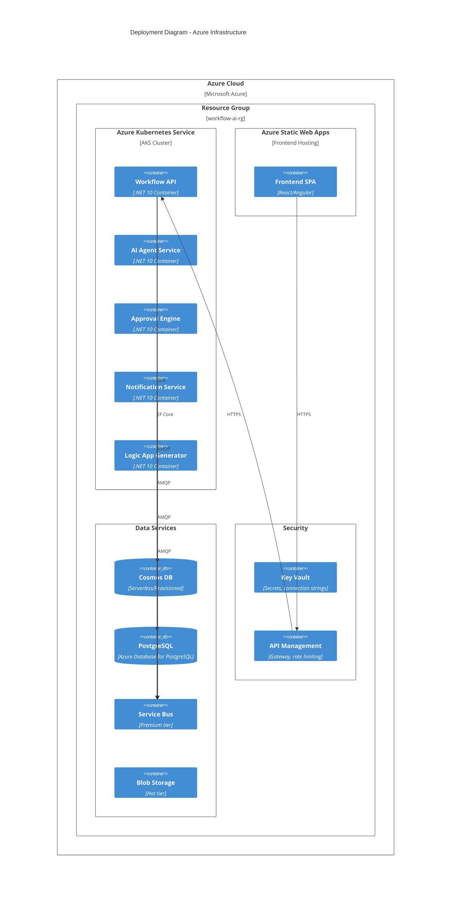

---

## 11. Frontend Data Model (API DTOs)

These DTOs are what the frontend consumes via the REST API:

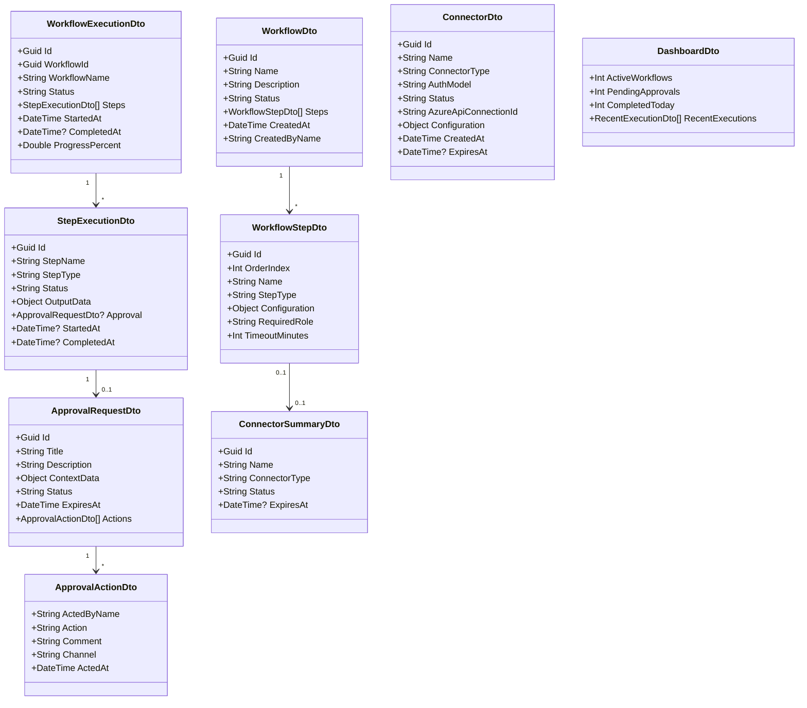

---
