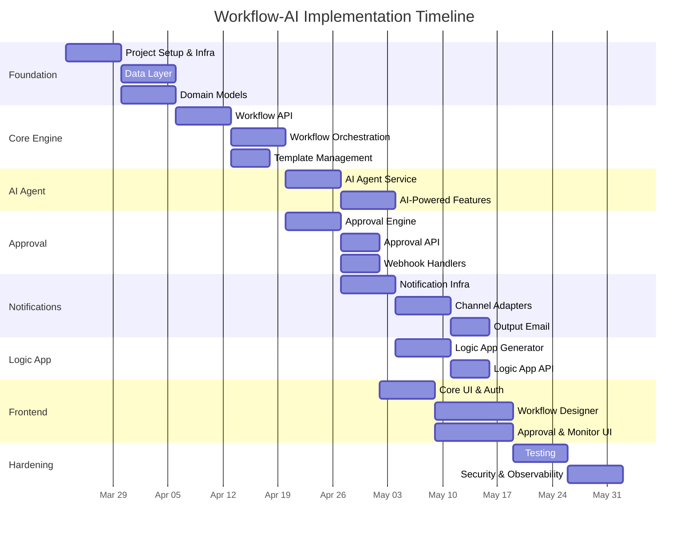

# Workflow-AI: Implementation Task Breakdown

## Phase 1 — Foundation (Weeks 1–3)

### 1.1 Project Setup & Infrastructure
- [ ] Create .NET 10 solution with project structure (API, Services, Domain, Infrastructure)
- [ ] Configure Azure resource group with Bicep/Terraform (Cosmos DB, PostgreSQL, Blob Storage, Service Bus, Key Vault, AKS)
- [ ] Set up CI/CD pipeline (GitHub Actions or Azure DevOps)
- [ ] Configure Entra ID app registration for OAuth 2.0 / OIDC
- [ ] Set up API Management / YARP gateway

### 1.2 Data Layer
- [ ] Implement Cosmos DB repository for Executions, Approvals, Notifications, AI Tasks (4 containers)
- [ ] Implement EF Core context for PostgreSQL (Users, Templates, Channels)
- [ ] Create database migrations and seed data
- [ ] Implement Unit of Work pattern for transactional consistency

### 1.3 Domain Models
- [ ] Define domain entities: Workflow, WorkflowStep, WorkflowExecution, StepExecution
- [ ] Define domain entities: ApprovalRequest, ApprovalAction, AIAgentTask
- [ ] Define domain entities: Notification, NotificationChannel, User
- [ ] Implement workflow state machine (Draft → Active → Archived)
- [ ] Implement step execution state machine (Pending → InProgress → WaitingApproval → Completed/Failed)

---

## Phase 2 — Core Workflow Engine (Weeks 3–5)

### 2.1 Workflow API
- [ ] `POST /api/workflows` — Create workflow
- [ ] `GET /api/workflows/{id}` — Get workflow with steps
- [ ] `PUT /api/workflows/{id}` — Update workflow
- [ ] `DELETE /api/workflows/{id}` — Soft-delete workflow
- [ ] `POST /api/workflows/{id}/execute` — Start workflow execution
- [ ] `GET /api/workflows/{id}/executions` — List executions
- [ ] `GET /api/executions/{id}` — Get execution with step statuses

### 2.2 Workflow Orchestration Service
- [ ] Implement WorkflowService (orchestration logic, step sequencing)
- [ ] Implement step executor factory (AIStep, ApprovalStep, NotificationStep, ActionStep)
- [ ] Service Bus integration: publish WorkflowStarted, StepCompleted, WorkflowCompleted events
- [ ] Service Bus consumer: listen for events and advance workflow steps

### 2.3 Template Management
- [ ] `GET /api/templates` — List workflow templates
- [ ] `POST /api/templates` — Create template
- [ ] `POST /api/templates/{id}/instantiate` — Create workflow from template

---

## Phase 3 — AI Agent Integration (Weeks 5–7)

### 3.1 AI Agent Service
- [ ] Azure OpenAI client setup with retry policies and circuit breaker
- [ ] Prompt template engine (variable substitution from step context)
- [ ] Tool calling support (structured output, function calling)
- [ ] Token usage tracking per AIAgentTask
- [ ] Service Bus consumer: process AI step execution requests

### 3.2 AI-Powered Features
- [ ] Content generation step type (generate reports, summaries, emails)
- [ ] Decision support step type (analyze data, recommend actions)
- [ ] Logic App connector mapping (AI-assisted step → connector translation)

---

## Phase 4 — Human-in-the-Loop Approval (Weeks 7–9)

### 4.1 Approval Engine
- [ ] ApprovalService: create approval requests with unique tokens
- [ ] Token-based approval endpoint: `GET /api/approvals/act?token={token}&action=approve|reject`
- [ ] Role-based approval routing (match step.RequiredRole to users)
- [ ] Timeout handling with background worker (check ExpiresAt, apply OnTimeoutAction)
- [ ] Escalation logic (re-route to manager/fallback approver)

### 4.2 Approval API
- [ ] `GET /api/approvals/pending` — List pending approvals for current user
- [ ] `POST /api/approvals/{id}/approve` — Approve with optional comment
- [ ] `POST /api/approvals/{id}/reject` — Reject with optional comment
- [ ] `GET /api/approvals/{id}` — Get approval details with action history

### 4.3 External Channel Webhooks
- [ ] `POST /api/webhooks/slack` — Handle Slack interaction payloads (button clicks)
- [ ] `POST /api/webhooks/teams` — Handle Teams adaptive card action payloads
- [ ] Webhook signature verification (Slack signing secret, Teams HMAC)

---

## Phase 5 — Notification Service (Weeks 9–11)

### 5.1 Core Notification Infrastructure
- [ ] NotificationRouter: route events to configured channels
- [ ] TemplateEngine: Razor/Liquid-based templates for email, Slack blocks, adaptive cards
- [ ] DeliveryTracker: log delivery status, implement retry with exponential backoff
- [ ] Service Bus consumer: process notification events

### 5.2 Channel Adapters
- [ ] **EmailAdapter**: Azure Communication Services integration
  - [ ] Approval request email with action links (approve/reject URLs with tokens)
  - [ ] Workflow completion output email (results summary)
  - [ ] Error/failure notification email
- [ ] **SlackAdapter**: Slack Web API / Webhooks
  - [ ] Block Kit message builder (approval card with buttons)
  - [ ] Channel configuration management
- [ ] **TeamsAdapter**: Microsoft Graph API
  - [ ] Adaptive Card builder (approval card with actions)
  - [ ] Teams channel/chat message posting

### 5.3 Output Notification (Email)
- [ ] Workflow completion email template (include execution summary, step results, AI outputs)
- [ ] Configurable recipient list per workflow
- [ ] Attach generated Logic App scripts or reports as email attachments

---

## Phase 6 — Logic App Script Generation (Weeks 11–13)

### 6.1 Logic App Generator
- [ ] Step-to-connector mapper (map WorkflowStep types to Logic App action types)
- [ ] ARM template builder (JSON definition generation)
- [ ] Bicep template builder (alternative IaC format)
- [ ] Include HTTP webhook actions for approval callbacks
- [ ] Include connector actions for Slack, Teams, Email
- [ ] Store generated templates in Blob Storage

### 6.2 Logic App API
- [ ] `POST /api/workflows/{id}/generate-logic-app` — Generate template
- [ ] `GET /api/workflows/{id}/logic-app-template` — Download generated template
- [ ] `POST /api/workflows/{id}/deploy-logic-app` — Deploy to Azure via ARM

---

## Phase 7 — Frontend (Weeks 13–16)

### 7.1 Core UI
- [ ] Authentication flow (Entra ID login, token management)
- [ ] Dashboard page (active workflows, pending approvals, recent activity)
- [ ] Workflow list page with filtering and search

### 7.2 Workflow Designer
- [ ] Drag-and-drop workflow step builder
- [ ] Step configuration panels (AI prompt, approval rules, notification channels)
- [ ] Workflow preview and validation
- [ ] Template selection and instantiation

### 7.3 Approval UI
- [ ] Pending approvals list with context preview
- [ ] Approval detail page (AI-generated context, approve/reject actions, comment)
- [ ] Approval history and audit trail

### 7.4 Execution Monitor
- [ ] Real-time execution progress (SignalR for live updates)
- [ ] Step-by-step status view with expandable details
- [ ] AI output viewer (formatted LLM responses)

---

## Phase 8 — Testing, Security & Hardening (Weeks 16–18)

### 8.1 Testing
- [ ] Unit tests (domain services, state machines, template engine)
- [ ] Integration tests (API endpoints, Service Bus, Cosmos DB)
- [ ] End-to-end tests (full workflow execution with approval)

### 8.2 Security
- [ ] Approval token security (single-use, expiring, signed tokens)
- [ ] Webhook signature verification hardening
- [ ] Key Vault integration for all secrets and connection strings
- [ ] RBAC enforcement (Admin, Approver, Viewer roles)
- [ ] Audit logging for all approval actions

### 8.3 Observability
- [ ] Application Insights integration (distributed tracing)
- [ ] Structured logging with correlation IDs
- [ ] Health checks for all services
- [ ] Azure Monitor alerts for failures and SLA breaches

---

## Dependency Graph

